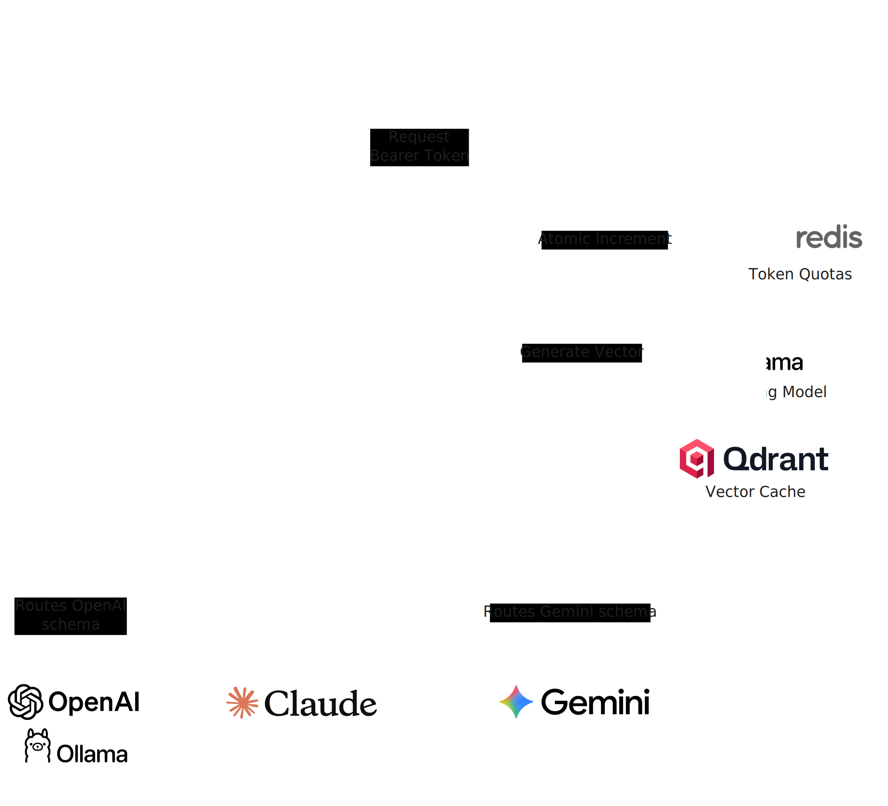

# Aegis-LLM Gateway

Aegis-LLM is an LLM gateway for teams that want lower latency and lower API spend without changing client integrations. It fronts upstream `/v1/*` calls, enforces Redis-backed rate limits, and serves semantically cached responses from Qdrant when possible.

It is designed for three outcomes:

1. Fast local setup for developers
2. Clear understanding of internals for maintainers
3. Predictable production deployment and operations

## Key Features

- **Drop-in Compatibility:** Native routing support for standard `/v1/*` OpenAI-compatible API calls.
- **Zero-Latency SSE Cache:** Intercepts, chunks, and replays Server-Sent Events to preserve the real-time LLM typing effect during cache hits.
- **High-Throughput Ingestion:** Time-and-size bounded background worker pools execute gRPC batch upserts to Qdrant without blocking user responses.
- **Precision Matching:** Combines semantic vector search (via Ollama) with strict model-aware and prompt-hash-aware validation.
- **O(1) Token Bucket Rate Limiting:** Atomic Redis Lua scripts ensure memory-efficient, burst-smoothed API quotas.
- **Privacy-First Security:** Bearer tokens are SHA-256 hashed before entering Redis memory or application logs.
- **Automated Cache Lifecycle:** TTL-based expiration with periodic background cleanup and automatic payload indexing.
- **Enterprise Observability:** Native OpenTelemetry (OTel) instrumentation for traces and metrics (`stdout` or OTLP).
- **Resilient Infrastructure:** Hardened HTTP proxy timeouts, fail-open database degradation, and graceful connection draining on shutdown.

## Table of Contents

- [Tech Stack](#tech-stack)
- [Prerequisites](#prerequisites)
- [Getting Started](#getting-started)
  - [1. Clone the Repository](#1-clone-the-repository)
  - [2. Install Dependencies](#2-install-dependencies)
  - [3. Start Local Infrastructure](#3-start-local-infrastructure)
  - [4. Environment Setup](#4-environment-setup)
  - [5. Run the Gateway](#5-run-the-gateway)
  - [6. Verify End-to-End](#6-verify-end-to-end)
- [Architecture](#architecture)
  - [Directory Structure](#directory-structure)
  - [Request Lifecycle](#request-lifecycle)
  - [Data Flow](#data-flow)
  - [Component Deep Dive](#component-deep-dive)
- [Environment Variables](#environment-variables)
  - [Upstream Auth](#upstream-auth)
  - [Optional Core and Infrastructure](#optional-core-and-infrastructure)
  - [Rate Limiting](#rate-limiting)
  - [Embeddings](#embeddings)
  - [Cache and Qdrant](#cache-and-qdrant)
  - [Telemetry](#telemetry)
  - [Recommended Production Values](#recommended-production-values)
- [Available Scripts](#available-scripts)
- [Testing](#testing)
- [Deployment](#deployment)
  - [Docker (Recommended)](#docker-recommended)
  - [Kubernetes Guidance](#kubernetes-guidance)
  - [Operational Runbook](#operational-runbook)
- [Troubleshooting](#troubleshooting)
- [Contributing](#contributing)
- [License](#license)

## Tech Stack

- **Language**: Go 1.25+ (module), Docker build stage uses Go 1.26
- **Gateway HTTP**: `net/http`, `httputil.ReverseProxy`
- **Vector Cache**: Qdrant via `github.com/qdrant/go-client`
- **Embeddings**: Ollama embeddings API
- **Rate Limiting**: Redis via `github.com/redis/go-redis/v9`
- **Observability**: OpenTelemetry SDK + OTLP/stdout exporters
- **Containerization**: Multi-stage Docker build (`Dockerfile`)

## Prerequisites

Minimum requirements:

- Go 1.25 or newer
- Docker (recommended for infra dependencies)
- Redis (default `6379`)
- Qdrant gRPC endpoint (default `6334`)
- Ollama embeddings endpoint (default `http://localhost:11434/api/embeddings`)
- Upstream provider API key (if your provider requires bearer auth)

Optional but helpful:

- `curl` for local API verification
- OTLP collector if using `TELEMETRY_EXPORTER=otlp`

## Getting Started

### 1. Clone the Repository

```bash
git clone https://github.com/nunoferna/aegis-llm.git
cd aegis-llm
```

### 2. Install Dependencies

Download Go module dependencies:

```bash
go mod download
```

### 3. Start Local Infrastructure

If you already run Redis/Qdrant/Ollama locally, skip this section.

Start Redis:

```bash
docker run --name aegis-redis --rm -p 6379:6379 redis:7-alpine
```

Start Qdrant:

```bash
docker run --name aegis-qdrant --rm -p 6333:6333 -p 6334:6334 qdrant/qdrant:v1.13.2
```

Start Ollama (if needed):

```bash
ollama serve
```

Pull embedding model used by default:

```bash
ollama pull all-minilm
```

### 4. Environment Setup

This repository does not include `.env.example` yet. Create your own `.env` (or export variables in shell) using the template below:

```bash
cat > .env <<'EOF'
PORT=8080

# Optional upstream auth (for providers that need bearer auth)
UPSTREAM_API_KEY=your-upstream-provider-key
UPSTREAM_BASE_URL=http://localhost:11434

# Infrastructure
QDRANT_HOST=localhost
QDRANT_PORT=6334
REDIS_HOST=localhost
REDIS_PORT=6379

# Rate limiting
RATE_LIMIT_MAX_REQUESTS=5
RATE_LIMIT_WINDOW=1m

# Embeddings
OLLAMA_EMBEDDING_URL=http://localhost:11434/api/embeddings
OLLAMA_EMBEDDING_MODEL=all-minilm
OLLAMA_EMBEDDING_TIMEOUT=5s

# Cache
CACHE_SAVE_QUEUE_SIZE=1024
CACHE_SAVE_WORKERS=4
CACHE_SAVE_TIMEOUT=2s
CACHE_VECTOR_SIZE=
MAX_CACHEABLE_BODY_BYTES=1048576
MAX_CACHEABLE_RESPONSE_BYTES=1048576
CACHE_ENTRY_TTL=24h
CACHE_SEARCH_LIMIT=5
CACHE_CLEANUP_INTERVAL=15m
CACHE_CLEANUP_TIMEOUT=5s
CACHE_CLEANUP_ENABLED=true
CACHE_INDEX_PAYLOAD_FIELDS=true

# Telemetry
TELEMETRY_EXPORTER=stdout
OTEL_EXPORTER_OTLP_ENDPOINT=localhost:4317
OTEL_EXPORTER_OTLP_INSECURE=true
OTEL_METRIC_EXPORT_INTERVAL=10s
OTEL_TRACE_SAMPLE_RATIO=1.0
OTEL_SERVICE_NAME=aegis-llm-gateway
OTEL_SERVICE_VERSION=1.0.0
EOF
```

Load the file in your shell:

```bash
set -a
source .env
set +a
```

### 5. Run the Gateway

Run directly:

```bash
go run ./cmd/aegis
```

Or build then run:

```bash
go build -o aegis-gateway ./cmd/aegis
./aegis-gateway
```

Expected startup log (example):

```text
🚦 Connected to Redis Rate Limiter
🧠 Connected to existing Qdrant collection: aegis_prompt_cache
🛡️ Aegis-LLM Gateway starting on port 8080...
```

### 6. Verify End-to-End

Send a non-streaming chat completion request:

```bash
curl -sS http://localhost:8080/v1/chat/completions \
  -H "Content-Type: application/json" \
  -H "Authorization: Bearer dev-user-token" \
  -d '{
    "model": "gpt-4.1-mini",
    "stream": false,
    "messages": [
      {"role":"user","content":"Explain semantic caching in one paragraph."}
    ]
  }'
```

On repeated prompt/model requests, you should see cache-hit logs in gateway output.

## Architecture

### Directory Structure

```text
.
├── cmd/
│   └── aegis/
│       └── main.go                  # Entrypoint, wiring, graceful shutdown
├── internal/
│   ├── cache/
│   │   ├── embedder.go              # Ollama embedding client
│   │   ├── middleware.go            # Cache middleware around proxy
│   │   ├── qdrant.go                # Qdrant client, workers, cleanup
│   ├── config/
│   │   ├── config.go                # Env parsing and defaults
│   ├── providers/
│   │   ├── anthropic.go             # Claude payload extraction
│   │   ├── gemini.go                # Google payload extraction
│   │   ├── openai.go                # OpenAI/Ollama payload extraction
│   │   └── provider.go              # Interface and dynamic routing logic
│   ├── proxy/
│   │   ├── proxy.go                 # Reverse proxy and dynamic upstream routing
│   ├── ratelimit/
│   │   ├── ratelimit.go             # Redis O(1) limiter middleware
│   └── telemetry/
│       └── telemetry.go             # OTEL provider setup
├── deploy/
│   └── charts/
│       └── aegis-llm/               # Helm chart for Kubernetes deployment
├── docs/
│   └── assets/
│       └── architecture.png         # Diagrams and visual assets
├── Dockerfile
├── go.mod
└── README.md
```

### Request Lifecycle

1. Request arrives at `/v1/*` or `/v1beta/*`
2. Rate limiter:
   - Validates `Authorization: Bearer ...`
   - Computes SHA-256 hashed token key
   - Atomically increments Redis Token Bucket
   - Returns `401`/`429` when needed
3. Cache middleware (for non-streaming chat-completions-style payloads):
   - Reads request body (bounded by `MAX_CACHEABLE_BODY_BYTES`)
   - Uses Provider Adapters to safely extract prompt and model (OpenAI, Anthropic, or Gemini)
   - Fetches embedding from Ollama
   - Searches Qdrant by vector, then applies model/hash/expiry logic
4. Cache hit: returns cached JSON (replays SSE chunks for streams)
5. Cache miss: Proxies to the dynamically detected upstream provider
6. Successful response capture:
   - Bounded by `MAX_CACHEABLE_RESPONSE_BYTES`
   - Enqueued for async save to Qdrant
7. Background maintenance:
   - Cleanup worker removes expired entries at configured interval
   - OTEL cleanup metrics are emitted

### Data Flow



```text
Client
  │
  ▼
HTTP /v1/*
  │
  ▼
Rate Limit (Redis)
  │
  ▼
Cache Middleware
  ├── Embeddings (Ollama)
  ├── Vector Search (Qdrant)
  └── Async Save Queue
  │
  ▼
Reverse Proxy
  │
  ▼
Upstream LLM API
```

### Component Deep Dive

#### 1) Configuration (`internal/config`)

- Centralized env parsing with defaults
- Uses typed parsers for safe fallback behavior.
- Loads dedicated API keys for different upstream providers (OPENAI_API_KEY, ANTHROPIC_API_KEY, GEMINI_API_KEY).

#### 2) Provider Adapters (`internal/providers`)

- Implements the Strategy Pattern to eliminate protocol fragmentation.
- Dynamically detects the requested AI format based on the URL path.
- Safely extracts prompts from complex multimodal JSON arrays without breaking the proxy passthrough.

#### 3) Proxy (`internal/proxy`)

- Acts as a Transparent Proxy rather than a brittle translation layer.
- Dynamically routes outbound traffic to official APIs (Anthropic, Google) or your default internal upstream (Ollama/vLLM).
- Injects the correct upstream API key header on the fly.
- Uses hardened transport settings (timeouts, connection pools).

#### 4) Rate Limiter (`internal/ratelimit`)

- O(1) Token Bucket implementation.
- Redis Lua script makes increment + expiration atomic.
- Fails open if Redis errors occur (availability-first behavior).

#### 5) Cache Middleware (`internal/cache/middleware.go`)

- Bypasses cache entirely for malformed payloads or uncacheable formats (e.g., image generation).
- Protects memory with strict body/response caps.
- Async save queue decouples user latency from vector DB storage latency.

#### 6) Qdrant Client (`internal/cache/qdrant.go`)

- Auto-creates collection and payload indexes (expires_at_unix, model, prompt_hash).
- Bounded save worker pool performs async gRPC upserts.
- Background cleanup worker regularly sweeps expired TTL points.

#### 7) Telemetry (`internal/telemetry`)

- Supports `stdout` and `otlp` exporters
- Configurable trace sample ratio and metric export interval
- Resource attributes include service name and version
- Main handler is wrapped by `otelhttp` instrumentation

## Environment Variables

### Upstream Auth

| Variable            | Description                                        | Example         |
| ------------------- | -------------------------------------------------- | --------------- |
| `OPENAI_API_KEY`    | OpenAI provider API key injected by gateway        | `sk-...`        |
| `ANTHROPIC_API_KEY` | Anthropic provider API key injected by gateway     | `anthropic-...` |
| `GEMINI_API_KEY`    | Google Gemini provider API key injected by gateway | `gemini-...`    |

### Optional Core and Infrastructure

| Variable            | Description       | Default                  |
| ------------------- | ----------------- | ------------------------ |
| `PORT`              | HTTP listen port  | `8080`                   |
| `UPSTREAM_BASE_URL` | Upstream base URL | `http://localhost:11434` |
| `QDRANT_HOST`       | Qdrant host       | `localhost`              |
| `QDRANT_PORT`       | Qdrant gRPC port  | `6334`                   |
| `REDIS_HOST`        | Redis host        | `localhost`              |
| `REDIS_PORT`        | Redis port        | `6379`                   |

### Rate Limiting

| Variable                  | Description                            | Default |
| ------------------------- | -------------------------------------- | ------- |
| `RATE_LIMIT_MAX_REQUESTS` | Max requests per token per window      | `5`     |
| `RATE_LIMIT_WINDOW`       | Window duration (`time.ParseDuration`) | `1m`    |

### Embeddings

| Variable            | Description            | Default                                 |
| ------------------- | ---------------------- | --------------------------------------- |
| `EMBEDDING_URL`     | Embedding endpoint URL | `http://localhost:11434/api/embeddings` |
| `MBEDDING_MODEL`    | Embedding model name   | `all-minilm`                            |
| `EMBEDDING_TIMEOUT` | Embedding HTTP timeout | `5s`                                    |

### Cache and Qdrant

| Variable                       | Description                                   | Default   |
| ------------------------------ | --------------------------------------------- | --------- |
| `CACHE_SAVE_QUEUE_SIZE`        | Async save queue size                         | `1024`    |
| `CACHE_SAVE_WORKERS`           | Number of save workers                        | `4`       |
| `CACHE_SAVE_TIMEOUT`           | Timeout per save operation                    | `2s`      |
| `CACHE_VECTOR_SIZE`            | Vector size override (auto-detected if unset) | _auto_    |
| `MAX_CACHEABLE_BODY_BYTES`     | Max request bytes handled by cache middleware | `1048576` |
| `MAX_CACHEABLE_RESPONSE_BYTES` | Max captured response bytes for cache saves   | `1048576` |
| `CACHE_ENTRY_TTL`              | Entry TTL                                     | `24h`     |
| `CACHE_SEARCH_LIMIT`           | Candidate count per vector query              | `5`       |
| `CACHE_CLEANUP_INTERVAL`       | Cleanup worker tick interval                  | `15m`     |
| `CACHE_CLEANUP_TIMEOUT`        | Cleanup run timeout                           | `5s`      |
| `CACHE_CLEANUP_ENABLED`        | Enable background cleanup worker              | `true`    |
| `CACHE_INDEX_PAYLOAD_FIELDS`   | Auto-create payload indexes on startup        | `true`    |

### Telemetry

| Variable                      | Description                            | Default             |
| ----------------------------- | -------------------------------------- | ------------------- |
| `TELEMETRY_EXPORTER`          | `stdout` or `otlp`                     | `stdout`            |
| `OTEL_EXPORTER_OTLP_ENDPOINT` | OTLP gRPC endpoint                     | `localhost:4317`    |
| `OTEL_EXPORTER_OTLP_INSECURE` | Use insecure OTLP transport            | `true`              |
| `OTEL_METRIC_EXPORT_INTERVAL` | Metrics export period                  | `10s`               |
| `OTEL_TRACE_SAMPLE_RATIO`     | Ratio from `0.0` to `1.0`              | `1.0`               |
| `OTEL_SERVICE_NAME`           | Service name for telemetry resource    | `aegis-llm-gateway` |
| `OTEL_SERVICE_VERSION`        | Service version for telemetry resource | `1.0.0`             |

### Recommended Production Values

Tune to workload and latency budget:

```bash
RATE_LIMIT_MAX_REQUESTS=120
RATE_LIMIT_WINDOW=1m

CACHE_SAVE_QUEUE_SIZE=8192
CACHE_SAVE_WORKERS=16
CACHE_SAVE_TIMEOUT=3s
CACHE_VECTOR_SIZE=1024
CACHE_ENTRY_TTL=12h
CACHE_SEARCH_LIMIT=8

CACHE_CLEANUP_ENABLED=true
CACHE_CLEANUP_INTERVAL=5m
CACHE_CLEANUP_TIMEOUT=10s
CACHE_INDEX_PAYLOAD_FIELDS=true

TELEMETRY_EXPORTER=otlp
OTEL_TRACE_SAMPLE_RATIO=0.2
OTEL_METRIC_EXPORT_INTERVAL=10s
```

## Available Scripts

| Command                                   | Description               |
| ----------------------------------------- | ------------------------- |
| `go run ./cmd/aegis`                      | Run gateway directly      |
| `go build -o aegis-gateway ./cmd/aegis`   | Build executable          |
| `./aegis-gateway`                         | Run built binary          |
| `go test ./...`                           | Run all tests             |
| `go test -run TestLoad ./internal/config` | Run a specific test set   |
| `go test -bench . ./internal/cache`       | Run cache benchmarks      |
| `go test -bench . ./internal/ratelimit`   | Run rate-limit benchmarks |
| `go vet ./...`                            | Run static analysis       |
| `gofmt -w ./...`                          | Format code               |
| `docker build . -t aegis-llm:local`       | Build container image     |
| `docker run ... aegis-llm:local`          | Run containerized gateway |

## Testing

Run the full suite:

```bash
go test ./...
go vet ./...
```

Run package-focused checks:

```bash
go test ./internal/cache ./internal/config ./internal/proxy ./internal/ratelimit
```

Run benchmarks:

```bash
go test -bench . -benchmem ./internal/cache
go test -bench . -benchmem ./internal/ratelimit
```

Current test areas include:

- Config parsing defaults and fallback behavior
- Proxy URL validation and auth header injection
- Rate-limit hash and middleware behavior
- Cache enqueue + middleware benchmarks

## Deployment

### Docker (Recommended)

This repository already includes a multi-stage `Dockerfile`.

Build:

```bash
docker build . -t aegis-llm:local
```

Run:

```bash
docker run --rm -p 8080:8080 \
  -e UPSTREAM_API_KEY="your-upstream-provider-key" \
  -e UPSTREAM_BASE_URL="http://host.docker.internal:11434" \
  -e QDRANT_HOST="host.docker.internal" \
  -e QDRANT_PORT="6334" \
  -e REDIS_HOST="host.docker.internal" \
  -e REDIS_PORT="6379" \
  -e OLLAMA_EMBEDDING_URL="http://host.docker.internal:11434/api/embeddings" \
  -e TELEMETRY_EXPORTER="otlp" \
  -e OTEL_EXPORTER_OTLP_ENDPOINT="host.docker.internal:4317" \
  aegis-llm:local
```

Production deployment checklist:

1. Pin image tag and digest
2. Use secret manager for `UPSTREAM_API_KEY`
3. Set CPU/memory limits for gateway and dependencies
4. Ensure Redis persistence policy matches durability expectations
5. Configure Qdrant storage and backups
6. Set OTLP endpoint and verify traces/metrics ingestion
7. Configure rolling deploy with readiness checks at infrastructure layer

### Kubernetes Guidance

No Kubernetes manifests are included currently. If deploying to Kubernetes:

1. Deploy gateway as a `Deployment`
2. Use `ConfigMap` for non-sensitive env vars and `Secret` for API keys
3. Add `Service` for internal/external exposure
4. Add `HorizontalPodAutoscaler` based on CPU and/or request rate
5. Use managed Redis/Qdrant or dedicated StatefulSets with persistence
6. Route OTLP to an in-cluster collector

### Operational Runbook

Monitor:

- Gateway request latency (overall and upstream)
- Cache hit ratio
- Rate-limit rejection volume
- Cleanup metrics:
  - `aegis_cache_cleanup_runs_total`
  - `aegis_cache_cleanup_deleted_total`
  - `aegis_cache_cleanup_errors_total`
  - `aegis_cache_cleanup_duration_seconds`

Tune when needed:

- High gateway memory:
  - Lower `MAX_CACHEABLE_BODY_BYTES`
  - Lower `MAX_CACHEABLE_RESPONSE_BYTES`
  - Lower `CACHE_SAVE_QUEUE_SIZE`
- Slow cache writes:
  - Increase `CACHE_SAVE_WORKERS`
  - Increase `CACHE_SAVE_TIMEOUT`
- Too many cache misses:
  - Confirm model consistency in requests
  - Verify embedding endpoint/model correctness
  - Increase `CACHE_SEARCH_LIMIT` carefully
- Expired entries not being reclaimed fast enough:
  - Reduce `CACHE_CLEANUP_INTERVAL`
  - Increase `CACHE_CLEANUP_TIMEOUT`

## Troubleshooting

### Upstream auth not being injected

Symptom: Upstream returns unauthorized when using a provider that requires bearer auth.

Fix:

```bash
export UPSTREAM_API_KEY="your-upstream-provider-key"
```

### 401 Missing or invalid Authorization header

Cause: Client did not send `Authorization: Bearer <token>`.

Fix:

```bash
curl ... -H "Authorization: Bearer any-dev-token"
```

### 429 Too Many Requests

Cause: Token exceeded configured limit in current window.

Fix options:

1. Increase `RATE_LIMIT_MAX_REQUESTS`
2. Use a longer `RATE_LIMIT_WINDOW`
3. Retry after `Retry-After` seconds

### Upstream provider unavailable (502)

Cause: Invalid `UPSTREAM_BASE_URL`, networking issue, or upstream outage.

Checks:

```bash
echo "$UPSTREAM_BASE_URL"
curl -I "$UPSTREAM_BASE_URL"
```

### Cache misses on repeated prompts

Likely causes:

1. Different `model` values across requests
2. `stream=true` requests bypass cache
3. Embedding endpoint/model mismatch
4. TTL elapsed (`CACHE_ENTRY_TTL`)

### No telemetry in collector

Checks:

```bash
echo "$TELEMETRY_EXPORTER"
echo "$OTEL_EXPORTER_OTLP_ENDPOINT"
```

Set OTLP mode:

```bash
export TELEMETRY_EXPORTER=otlp
export OTEL_EXPORTER_OTLP_ENDPOINT=localhost:4317
export OTEL_EXPORTER_OTLP_INSECURE=true
```

## Contributing

1. Create a feature branch
2. Make focused changes
3. Run formatting and validation:

```bash
gofmt -w ./...
go test ./...
go vet ./...
```

4. Open a PR with:
   - clear summary
   - configuration impact
   - test evidence

## License

This project is licensed under Apache License 2.0. See [LICENSE](LICENSE).
